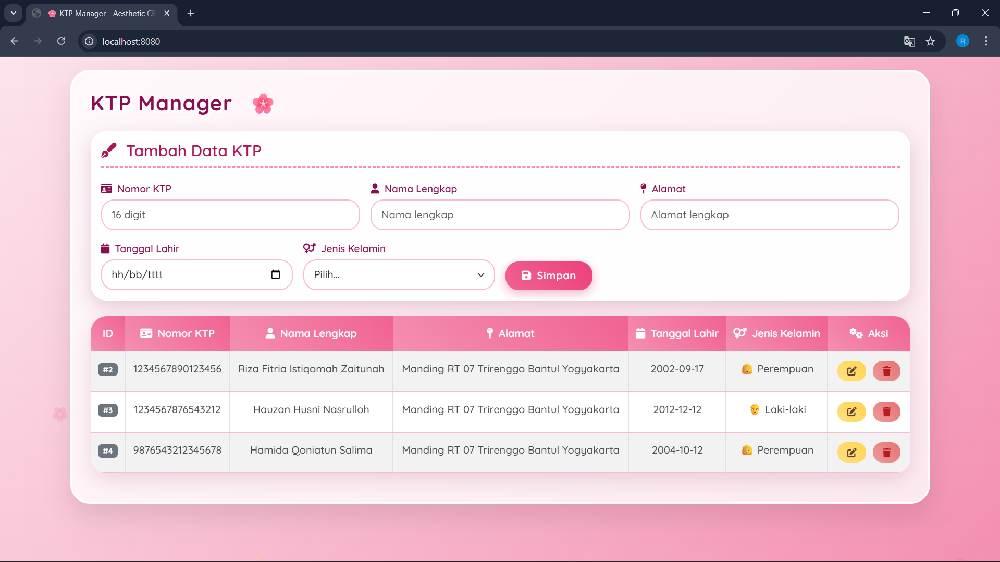
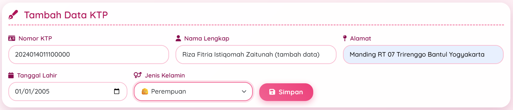
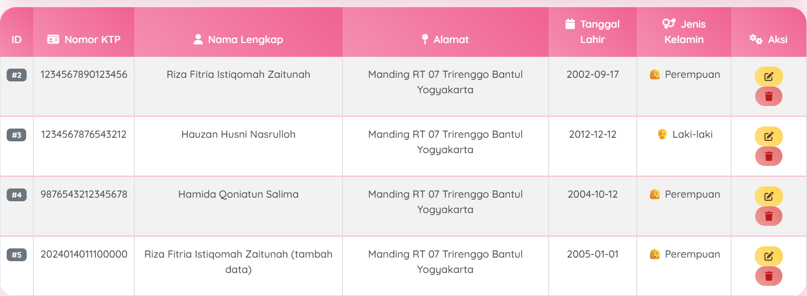

# 📁 Tugas CRUD KTP - 20240140111
#### || Riza Fitria Istiqomah Zaitunah ||

> **Aplikasi Manajemen Data KTP** berbasis Web dengan Spring Boot + MySQL + AJAX jQuery

---
### 🌐 _preview web_


## 📋 DAFTAR ISI
- [Fitur Aplikasi](#fitur-aplikasi)
- [Teknologi yang Digunakan](#teknologi-yang-digunakan)
- [Struktur Database](#struktur-database)
- [Dokumentasi API](#dokumentasi-api)
- [Cara Menjalankan](#cara-menjalankan)
- [Screenshot Aplikasi](#screenshot-aplikasi)
- [Author](#author)

---

## 🖥️ FITUR APLIKASI

**1. CREATE** - Tambah data KTP baru  
**2. READ** - Lihat semua data KTP  
**3. UPDATE** - Edit data KTP  
**4. DELETE** - Hapus data KTP  
**5. Validasi** - Nomor KTP unik (tidak boleh duplikat)  
**6. Responsive** - Tampilan aesthetic dengan Bootstrap  
**7. AJAX** - Semua operasi tanpa reload halaman

---

## 🛠 TEKNOLOGI YANG DIGUNAKAN

| Teknologi | Version |
|-----------|---------|
| Java | 25.0.2 |
| Spring Boot | 4.0.3 |
| MySQL | 8.0.41 |
| Hibernate | 7.2.4.Final |
| Lombok | 1.18.42 |
| MapStruct | 1.5.5.Final |
| Bootstrap | 5.3.0 |
| jQuery | 3.6.4 |
| Font Awesome | 6.4.0 |

---

## 🗄️ STRUKTUR DATABASE

### Tabel: `ktp`

```sql
CREATE TABLE `ktp` (
   `id` int NOT NULL AUTO_INCREMENT,
   `alamat` varchar(255) DEFAULT NULL,
   `jenis_kelamin` varchar(255) DEFAULT NULL,
   `nama_lengkap` varchar(255) NOT NULL,
   `nomor_ktp` varchar(16) NOT NULL,
   `tanggal_lahir` date DEFAULT NULL,
   PRIMARY KEY (`id`),
   UNIQUE KEY `UKd0wfq3hccvdfb4whp3kd7kl7h` (`nomor_ktp`)
 ) ENGINE=InnoDB AUTO_INCREMENT=5 DEFAULT CHARSET=utf8mb4 COLLATE=utf8mb4_0900_ai_ci
```

# 📚 DOKUMENTASI API

> **Base URL:** http://localhost:8080 

**1. GET All KTP**
- Endpoint: /ktp 
- Method: GET 
- Response:

**2. GET KTP by ID**
- Endpoint: /ktp/{id}
- Method: GET
- Response:

**3. POST Tambah KTP**
- Endpoint: /ktp
- Method: POST
- Headers: Content-Type: application/json 
- Request Body:

> {
"nomorKtp": "1234567890123456",
"namaLengkap": "Budi Santoso",
"alamat": "Jl. Merdeka No. 1",
"tanggalLahir": "1990-01-01",
"jenisKelamin": "Laki-laki"
}

- Response:

**4. PUT Update KTP**
- Endpoint: /ktp/{id} 
- Method: PUT 
- Headers: Content-Type: application/json 
- Request Body:

> {
"nomorKtp": "1234567890123456",
"namaLengkap": "Budi Santoso Update",
"alamat": "Jl. Baru No. 10",
"tanggalLahir": "1990-01-01",
"jenisKelamin": "Laki-laki"
}
``
- Response :

**5. DELETE Hapus KTP**
- Endpoint: /ktp/{id} 
- Method: DELETE 
- Response:

> **SCREENSHOOT WEBSITE**
- Tampilan utama web
  
- Form Tambah Data

- Data berhasil ditampilkan

- Edit data
- Test API dengan Postman
- Struktur database


